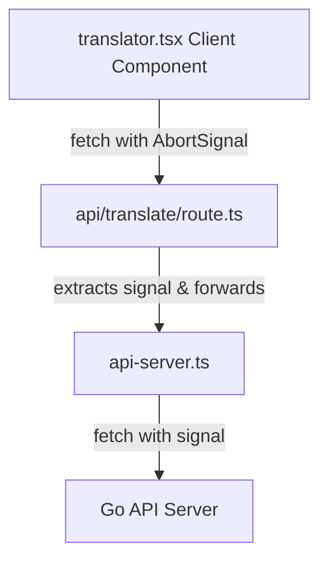

# Next.js Request Cancellation: Server Actions vs Route Handlers

This document outlines the architectural pattern for handling request cancellation (using `AbortSignal`) in a Next.js App Router application while preserving a centralized, authenticated fetch layer.

---

## The Problem: Outgoing Server Cost Control

When a user initiates an expensive API call (such as a translation request using Google Cloud Translation API) and cancels it mid-way (e.g., by typing a new character during a search/debounce), we want to:
1. **Terminate the request immediately** on the client side.
2. **Propagate the cancellation to the Next.js server** to save resources.
3. **Cancel the upstream fetch request** from Next.js to the Go API backend.

---

## Architectural Limitation: Server Actions (`'use server'`)

Next.js Server Actions are designed for mutations and are wrapped in Next.js's internal form-action serialization protocol.

* **No Client-to-Server Cancellation**: Next.js does not expose the underlying HTTP connection's `AbortSignal` inside a Server Action function.
* **Non-Serializable Arguments**: Server Actions require all arguments to be fully serializable. The browser's native `AbortSignal` or the standard `Headers` class cannot be serialized and sent over a Server Action POST request boundary.
* **No Generic Functions**: Next.js compiler cannot generate static client wrappers for generic functions (e.g., `apiFetch<T>`).

---

## The Solution: Next.js Route Handlers (`route.ts`)

To cancel requests and propagate the cancellation upstream, use a Next.js **Route Handler** as a middleman. 

### Data Flow Layout



### 1. Centralized Fetch Wrapper (`api-server.ts`)
Keep `api-server.ts` as a server-only utility (using `import "server-only"`). Both Server Actions and Route Handlers should call this helper to keep cookies, tokens, and authorization headers centralized.

### 2. Next.js Route Handler (`app/api/translate/route.ts`)
Create a Route Handler that extracts `request.signal` and calls `apiFetch`:

```typescript
import { NextRequest, NextResponse } from "next/server";
import { apiFetch } from "@/lib/api-server";

export async function POST(request: NextRequest) {
    try {
        const { signal } = request;
        const { text, target } = await request.json();

        const res = await apiFetch("api/translate", {
            method: "POST",
            headers: { "Content-Type": "application/json" },
            body: JSON.stringify({ text, target }),
            signal, // Forward the abort signal
        });

        return NextResponse.json(res);
    } catch (error: any) {
        return NextResponse.json({ success: false, message: error.message }, { status: 500 });
    }
}
```

### 3. Client Component (`translator.tsx`)
Call the Route Handler using the standard browser `fetch` and an `AbortController`:

```typescript
useEffect(() => {
    if (sourceText.trim() === '') return;

    const controller = new AbortController();
    const { signal } = controller;

    const fetchData = async () => {
        const res = await fetch("/api/translate", {
            method: "POST",
            headers: { "Content-Type": "application/json" },
            body: JSON.stringify({ text: sourceText, target: targetLang }),
            signal,
        });
        const data = await res.json();
        // Handle data...
    };

    fetchData().catch((err) => {
        if (err.name === 'AbortError') {
            console.log('Request was cancelled');
        }
    });

    return () => controller.abort(); // Cancel request when dependencies change
}, [sourceText, targetLang]);
```

---

## Best Practices Decision Matrix

| Requirement | Use Server Action | Use Route Handler |
| :--- | :---: | :---: |
| Normal Form Submission / Mutations | ✅ | |
| Next.js Form State Integrations | ✅ | |
| Client-Side Cancellation Support (`AbortSignal`) | | ✅ |
| Real-time Data / Streaming Responses (SSE/AI) | | ✅ |
| Public API endpoints consumed by other apps | | ✅ |
